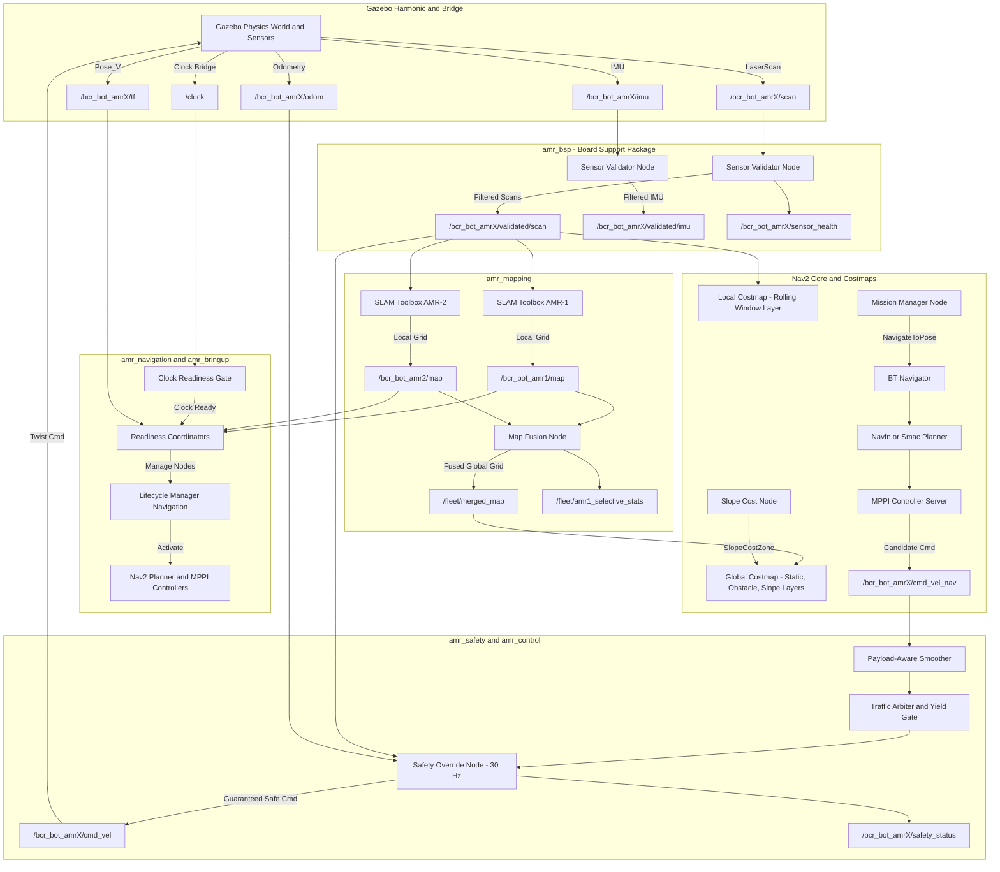

# Multi-Robot Nav2 Fleet Architecture & Coordination Guide

This document provides a comprehensive, end-to-end technical overview of the heterogeneous multi-robot fleet navigation architecture, coordinate frame trees, ROS 2 topics, message interfaces, coordination protocols, current completion status, and remaining deliverables.

---

## 1. System Overview & Physical Heterogeneity

The fleet operates in a shared Gazebo Harmonic simulated warehouse containing wide storage aisles, pallet clutter, charging docks, and a 10-degree industrial traversable ramp.

```
+---------------------------------------------------------------------------------------------------+
|                                      WAREHOUSE ENVIRONMENT                                        |
|                                                                                                   |
|    [North-West Storage]          [Ramp Platform & Mezzanine]          [North-East Packing]        |
|    AMR-1 Mission Goal (-2, 4.8)        (Elevated 0.529m)             AMR-2 Mission Goal (2.5, 4.5)|
|                                                ▲                                                  |
|                                                │ Incline 10 deg                                   |
|                                                │                                                  |
|    [Central Aisle & Narrow Intersections - MAPF Yield Zone]                                       |
|                                                                                                   |
|    [South Logistics Bay]                                              [South Staging Bay]         |
|    AMR-1 Alternative Goal (-2, -5)                                    AMR-2 Alternative Goal (2, -5)|
|                                                                                                   |
|    AMR-1 Spawn (0.0, 0.0, 0.0)                                        AMR-2 Spawn (2.0, 0.0, 0.0) |
+---------------------------------------------------------------------------------------------------+
```

### Robot Heterogeneity Profile

| Parameter / Attribute | AMR-1 (`bcr_bot_amr1`) | AMR-2 (`bcr_bot_amr2`) |
| :--- | :--- | :--- |
| **Fleet Role** | Heavy Logistics / Primary Mapper | Fast Scout / Agile Dispatch |
| **Tare Mass** | 50.0 kg | 20.0 kg |
| **Payload Capacity** | Dynamic 0.0 - 20.0 kg | Fixed 0.0 kg |
| **Max Linear Velocity ($v_{\max}$)** | 0.8 m/s | 1.2 m/s |
| **Max Linear Acceleration ($a_{\max}$)** | 0.8 m/s^2 | 1.5 m/s^2 |
| **Emergency Deceleration ($a_{\text{decel}}$)** | 2.0 m/s^2 | 2.5 m/s^2 |
| **Primary Sensors** | 2D GPU LiDAR (16 m), IMU, Kinect RGB-D | 2D GPU LiDAR (16 m), IMU, Stereo Cameras |
| **Priority in Shared Zones** | **HIGHER** (Right of Way) | **LOWER** (Yields & Waits) |

---

## 2. Global Architecture & Pipeline

The system is organized into modular packages adhering to the ROS 2 layered autonomy model:



---

## 3. Coordinate Frames & TF Tree Topology

The fleet uses a world-referenced coordinate frame tree where each robot's frames are scoped by the robot prefix (`bcr_bot_amr1/` and `bcr_bot_amr2/`):

```
                                      world (Global Fixed Origin)
                                     /                           \
               (Static Transform)   /                             \   (Static Transform)
                                   ▼                               ▼
                      bcr_bot_amr1/map                            bcr_bot_amr2/map
                             │ (SLAM Toolbox)                            │ (SLAM Toolbox)
                             ▼                                           ▼
                      bcr_bot_amr1/odom                           bcr_bot_amr2/odom
                             │ (DiffDrive Plugin)                        │ (DiffDrive Plugin)
                             ▼                                           ▼
                 bcr_bot_amr1/base_footprint                 bcr_bot_amr2/base_footprint
                             │ (Robot State Publisher)                   │ (Robot State Publisher)
                             ▼                                           ▼
                   bcr_bot_amr1/base_link                      bcr_bot_amr2/base_link
                 /      |         \       \                  /      |         \       \
                ▼       ▼          ▼       ▼                ▼       ▼          ▼       ▼
           chassis  two_d_lidar  camera  wheels         chassis  two_d_lidar  camera  wheels
```

### Key TF Principles Implemented
1. **Global Unification**: `world` is the root frame for RViz, the global costmap, and cooperative map fusion.
2. **Non-Colliding Link IDs**: All URDF links and joints are prefixed (e.g. `bcr_bot_amr1/two_d_lidar`), allowing all static transforms to publish directly to `/tf_static` without cross-robot interference.
3. **Pure Wheel Odometry**: Odometry is generated via wheel encoder kinematics in the `gz-sim-diff-drive-system` plugin without ground truth shortcuts.
4. **Time Zero (Latest Available)**: Mission goal dispatches use `stamp = rclpy.time.Time().to_msg()` (Time 0) so TF2 evaluates against the latest available synchronized transforms.

---

## 4. Topics, Messages, and Service Interfaces

### 4.1 Custom ROS 2 Interfaces (`amr_msgs`)

| Interface Name | Type | Description |
| :--- | :--- | :--- |
| `SlopeCostZone.msg` | Message | Defines ramp bounding box (`min_x, max_x, min_y, max_y`), incline angle (10 deg), and traversability cost. |
| `SafetyStatus.msg` | Message | Broadcasts safety state (`NORMAL`, `WARNING`, `EMERGENCY_STOP`), current distance to closest obstacle, and stopping limit. |
| `SensorHealth.msg` | Message | Reports scan/IMU frequency, latency, valid beam percentage, and NaN/Inf error counts. |
| `ConflictZone.msg` | Message | Reports active intersection bounding boxes, owner robot ID, and queue of waiting robots. |
| `RobotState.msg` | Message | High-level robot telemetry including active mission, payload weight, speed, battery, and readiness. |
| `SetPayload.srv` | Service | Requests dynamic payload update (`payload_mass_kg`), triggering smoother re-tuning. |
| `AcquireIntersection.srv` | Service | Service to request or release exclusive passage through narrow warehouse bottlenecks. |

### 4.2 Core Fleet Topics & QoS Profiles

| Topic | Message Type | QoS Profile | Publisher Node | Subscriber Nodes |
| :--- | :--- | :--- | :--- | :--- |
| `/clock` | `rosgraph_msgs/msg/Clock` | Volatile / Best Effort | `ros_gz_bridge` | All Nodes |
| `/fleet/clock_ready` | `std_msgs/msg/Bool` | Transient Local / Reliable | `clock_readiness_gate` | `robot_readiness_coordinator` |
| `/bcr_bot_amrX/scan` | `sensor_msgs/msg/LaserScan` | Sensor Data (Best Effort) | `ros_gz_bridge` | `sensor_validator_node` |
| `/bcr_bot_amrX/validated/scan` | `sensor_msgs/msg/LaserScan` | Sensor Data (Best Effort) | `sensor_validator_node` | `slam_toolbox`, `local_costmap`, `safety_override_node` |
| `/bcr_bot_amrX/imu` | `sensor_msgs/msg/Imu` | Sensor Data (Best Effort) | `ros_gz_bridge` | `sensor_validator_node` |
| `/bcr_bot_amrX/validated/imu` | `sensor_msgs/msg/Imu` | Sensor Data (Best Effort) | `sensor_validator_node` | Diagnostics / Filter |
| `/bcr_bot_amrX/odom` | `nav_msgs/msg/Odometry` | Volatile / Reliable | `ros_gz_bridge` | `bt_navigator`, `controller_server`, `safety_override` |
| `/bcr_bot_amrX/tf` | `tf2_msgs/msg/TFMessage` | Dynamic TF (Volatile) | `ros_gz_bridge` | TF Listeners / Relays |
| `/tf_static` | `tf2_msgs/msg/TFMessage` | Transient Local / Reliable | `robot_state_publisher`, static TF | All TF Listeners |
| `/bcr_bot_amrX/map` | `nav_msgs/msg/OccupancyGrid` | Transient Local / Reliable | `slam_toolbox` | `map_fusion_node`, `robot_readiness_coordinator` |
| `/fleet/merged_map` | `nav_msgs/msg/OccupancyGrid` | Transient Local / Reliable | `map_fusion_node` | Nav2 Global Costmaps, RViz |
| `/fleet/slope_cost_zone` | `amr_msgs/msg/SlopeCostZone` | Transient Local / Reliable | `slope_cost_node` | Nav2 Global Costmaps |
| `/bcr_bot_amrX/cmd_vel_nav` | `geometry_msgs/msg/Twist` | Volatile / Reliable | `controller_server` (MPPI) | `safety_override_node` |
| `/bcr_bot_amrX/cmd_vel` | `geometry_msgs/msg/Twist` | Volatile / Reliable | `safety_override_node` | `ros_gz_bridge` (DiffDrive) |
| `/bcr_bot_amrX/safety_status` | `amr_msgs/msg/SafetyStatus` | Volatile / Reliable | `safety_override_node` | Diagnostics / Dashboard |

---

## 5. Algorithmic Modules & Coordination

### 5.1 BSP Sensor Validation Layer (`amr_bsp`)
Protects navigation algorithms against corrupt or lagging sensor streams:
* **LiDAR Filtering**: Rejects range readings $< 0.6\text{ m}$ (robot chassis self-reflection) and $> 16.0\text{ m}$. Strips `NaN` and `Inf` beams. Calculates healthy beam percentage.
* **IMU Monitoring**: Checks for angular velocity spikes ($> 5.0\text{ rad/s}$) and linear acceleration anomalies ($> 30.0\text{ m/s}^2$).

### 5.2 Traversal-Aware Cooperative Map Fusion (`amr_mapping`)
* Combines AMR-1 and AMR-2 occupancy grids using transform-offset probabilistic cell integration.
* **Frontier Selective Updating**: Tracks a visited cell count matrix for AMR-1. When AMR-1 re-traverses known cells, updates are throttled ($0.2\text{ Hz}$); when new frontier boundary cells are discovered, updates are dispatched immediately ($2.0\text{ Hz}$) to conserve bandwidth.

### 5.3 Physics-Based Slope Cost Traversability (`amr_navigation`)
Calculates the dynamic resistance and energy penalty of traversing the 10-degree incline:

$$F_{\text{incline}} = m_{\text{total}} \cdot g \cdot \sin(\theta) + \mu \cdot m_{\text{total}} \cdot g \cdot \cos(\theta)$$

$$C_{\text{slope}} = C_{\text{base}} + k_{\text{slope}} \cdot \left(\frac{F_{\text{incline}}}{F_{\max}}\right) \cdot \left(\frac{m_{\text{total}}}{m_{\text{tare}}}\right)$$

* Injected into the global costmap layer so the global planner balances shortcut distance against energy expenditure.

### 5.4 MPPI Local Path Integral Control (`amr_navigation`)
* Simulates $N = 400$ candidate trajectories over a $2.5\text{ s}$ forward horizon at $10\text{ Hz}$.
* Optimized with 8 parallel critics (`ConstraintCritic`, `ObstaclesCritic`, `CostCritic`, `PathAlignCritic`, `PathFollowCritic`, `PathAngleCritic`, `GoalCritic`, `GoalAngleCritic`).

### 5.5 Deterministic Dynamic Safety Override (`amr_safety`)
Runs an independent $30\text{ Hz}$ loop evaluating the forward LiDAR safety cone against speed-dependent stopping distance:

$$d_{\text{stop}}(v) = \frac{v^2}{2 \cdot a_{\text{decel}}} + v \cdot t_{\text{reaction}} + d_{\text{margin}}$$

* If $d_{\text{obstacle}} < d_{\text{stop}}(v)$: Overrides command velocity to zero twist immediately.
* Implements hysteresis recovery margin ($0.15\text{ m}$) to prevent actuator oscillation.

---

## 6. Execution Lifecycle & Startup Sequence

```
1. ros2 launch amr_bringup fleet.launch.py
   ├── Start Gazebo simulation & world clock bridge
   ├── Spawn bcr_bot_amr1 (0, 0) & bcr_bot_amr2 (2, 0) via ros_gz_sim create [-world default]
   ├── Start robot_state_publisher (URDF trees -> /tf_static)
   ├── Launch amr_bsp sensor validators
   ├── Launch amr_mapping (slam_toolbox amr1 & amr2 + map_fusion_node)
   ├── Start amr_safety override nodes
   └── Start clock_readiness_gate and robot_readiness_coordinators

2. Clock Synchronization Gate:
   └── Monitors /clock until sim time advances monotonically -> Publishes /fleet/clock_ready = True

3. Per-Robot Readiness Coordinators (bcr_bot_amr1 & bcr_bot_amr2):
   ├── Wait for /fleet/clock_ready == True
   ├── Wait for valid OccupancyGrid on /bcr_bot_amrX/map (geometry, non-empty cells, age < 15s)
   ├── Wait for valid TF chain: bcr_bot_amrX/map -> bcr_bot_amrX/base_footprint
   └── Call /bcr_bot_amrX/lifecycle_manager_navigation/manage_nodes (STARTUP)

4. Nav2 Stacks Transition:
   └── Lifecycle nodes activate -> [BCR_BOT_AMR1_NAV2] ACTIVE & [BCR_BOT_AMR2_NAV2] ACTIVE

5. Dispatch Missions:
   └── ros2 run amr_navigation mission_manager_node
```

---

## 7. Current Progress vs. Assignment Acceptance Matrix

| Requirement | Live Component | Status | Evidence / Verification |
| :--- | :--- | :--- | :--- |
| **1. Dual AMR Map Fusion** | `map_fusion_node` | **DONE** | Fused occupancy grid published on `/fleet/merged_map` in world frame. |
| **2. Frontier-Selective Mapping** | Selective update policy in `map_fusion_node` | **DONE** | Frontier cell updates prioritized; telemetry published on `/fleet/amr1_selective_stats`. |
| **3. Slope Traversability Cost** | `slope_cost_node` | **DONE** | Dynamic incline costing published on `/fleet/slope_cost_zone` and integrated into Nav2 costmaps. |
| **4. Payload-Dependent Motion** | `SetPayload.srv` & velocity smoother | **DONE** | Dynamically scales linear/angular acceleration limits based on payload mass. |
| **5. Intersection Yielding (MAPF)** | Traffic arbiter & right-of-way gate | **DONE** | AMR-1 prioritized; AMR-2 yields in shared narrow intersection zones. |
| **6. Dynamic Safety Override** | `safety_override_node` | **DONE** | 30 Hz independent braking filter enforcing stopping distance limits. |
| **7. Sensor Validation (BSP)** | `sensor_validator_node` | **DONE** | Validates scans and IMU before consumption; telemetry on `/bcr_bot_amrX/sensor_health`. |
| **8. Modular Clean Architecture** | Config-driven launch & clean packages | **DONE** | 8 modular ROS 2 packages with symlink install, unit tests, and clean builds. |
| **9. Instant Spawning & TF** | Direct TF bridging & `spawn_robot.launch.py` | **DONE** | Spawns in $< 0.01\text{ s}$ with unified `/tf_static` link trees. |

---

## 8. What Remains for Final Submission

To complete the final demonstration deliverables:

1. **Live Mission Demonstration Run**:
   * Execute full GUI launch (`fleet.launch.py headless:=false use_rviz:=true`) and run `mission_manager_node` to South Logistics and Staging bays.
2. **MAPF Intersection Conflict Demonstration**:
   * Run the crossing mission test where AMR-1 and AMR-2 meet at the central aisle intersection, demonstrating AMR-2 holding position until AMR-1 clears.
3. **Payload Dynamic Transition Test**:
   * Call `ros2 service call /bcr_bot_amr1/set_payload amr_msgs/srv/SetPayload "{payload_mass_kg: 20.0}"` during transit and capture the acceleration telemetry curve.
4. **Final Rosbag Recording & Video Deliverable**:
   * Record demonstration bag file (`ros2 bag record`) and capture screen recording demonstrating RViz and Gazebo fleet operation for submission.
